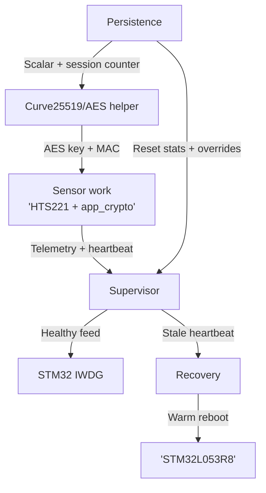
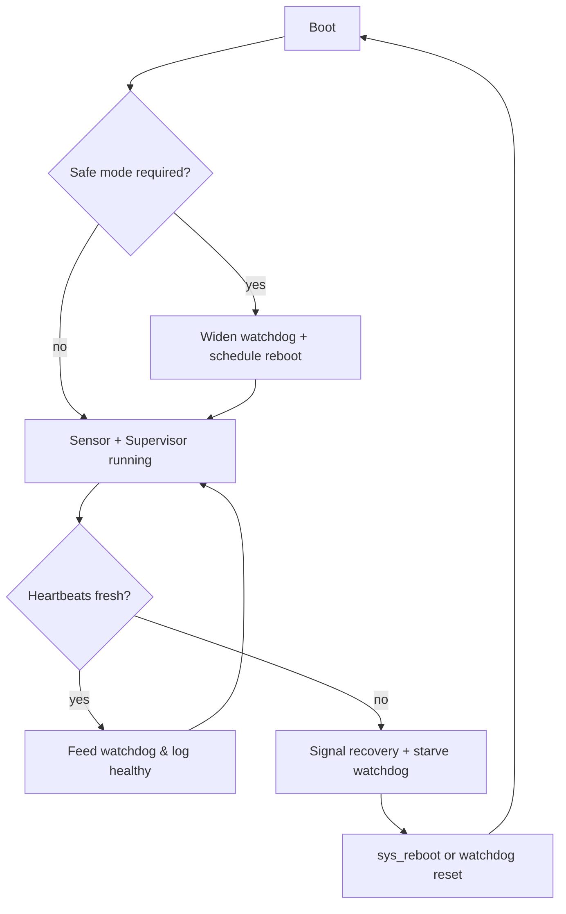

# zephyr-secure-supervisor – Sensor + Watchdog Supervisor Stack
[](https://github.com/ramirezramiro/zephyr-secure-supervisor/actions/workflows/native-sim.yml)

**Board:** STM32 NUCLEO‑L053R8 | **RTOS:** Zephyr 4.2 | **Focus:** Watchdog health, encrypted telemetry, MISRA-inspired hygiene

Designed for the NUCLEO-L053R8’s 8 KB SRAM envelope, zephyr-secure-supervisor keeps watchdog, crypto, and telemetry services lean so low-power boards can adopt it without extra tuning.

## Curve25519 on 8 KB (PQC-Friendly Shim)

The STM32L053R8’s 8 KB SRAM budget is too tight for a true PQC primitive, so the best we can ship on this board is a Curve25519-backed AES helper with per-device scalars, session salts, and MAC tags. It exercises the same migration hooks we’d use for a future PQC drop, but it should be viewed as a PoC rather than a full post-quantum solution.

`src/app_crypto.c` and `src/simple_aes.c` still wrap every persistence + telemetry call, so moving to a higher-spec MCU (≥16 KB SRAM with secure storage) lets you swap in heavier PQC libraries without touching watchdog/sensor code. Use [docs/crypto_backends.md](docs/crypto_backends.md) for the AES vs Curve toggles, UART cues, scalar lifecycle, and MAC tagging notes; see `docs/app_crypto.md` for API details and `docs/persist_state.md` / `tests/persist_state` to validate encrypted blobs on host or hardware.

## Quick Start

1. `west build -b nucleo_l053r8 -p auto .`
2. `west flash -r openocd`
3. `sudo screen /dev/ttyACM0 115200`

Need MISRA hardware tests? Run the MISRA commands in the Testing Strategy section.

### Build & Flash Cheatsheet

| Task | Command(s) | Result |
|------|------------|--------|
| Build + flash application | `west build -b nucleo_l053r8 -p auto . && west flash -r openocd` | Deploys the watchdog/sensor firmware to the board. |
| Monitor UART logs | `sudo screen /dev/ttyACM0 115200` | Shows EVT telemetry + AES transition. |
| Run MISRA hardware ztests | `cd <workspace>; west build -p always <repo>/tests/unit/misra_stage1 -b nucleo_l053r8 --build-dir build/tests/unit/misra_stage1; west flash -r openocd --build-dir build/tests/unit/misra_stage1; sudo screen /dev/ttyACM0 115200` | Executes `tests/unit/misra_stage1` on hardware. |
| Run native persistence test | `west build -b native_sim tests/persist_state -p auto --build-dir build/tests/persist_state && west build -t run --build-dir build/tests/persist_state` | Validates NVS + safe-memory helpers on host. |
| Run native supervisor test | `west build -b native_sim tests/supervisor -p auto --build-dir build/tests/supervisor && west build -t run --build-dir build/tests/supervisor` | Exercises heartbeat/recovery escalation logic. |

## Testing Strategy

| Suite | Target | Command | Coverage |
|-------|--------|---------|----------|
| `tests/persist_state` | `native_sim` | `west build -b native_sim tests/persist_state -p auto --build-dir build/tests/persist_state && west build -t run --build-dir build/tests/persist_state` | NVS state machine, reset counter math, and watchdog override setters without hardware. |
| `tests/supervisor` | `native_sim` | Similar pattern under `tests/supervisor` | Grace windows, heartbeat staleness, failure escalation logic. |
| `tests/unit/misra_stage1` | `nucleo_l053r8` | `west build -p always tests/unit/misra_stage1 -b nucleo_l053r8 && west flash -r openocd` | Hardware validation for safe memory wrappers, AES persistence round-trips, supervisor snapshot helpers, and recovery event plumbing. |

The MISRA suite reuses production sources, so every edit to `safe_memory`, persistence, supervisor, or recovery logic can be proven on the real MCU in under a minute. Use the commands below to build/flash and monitor logs:

```
cd <your-zephyr-workspace>
west build -p always <path-to-repo>/tests/unit/misra_stage1 -b nucleo_l053r8 --build-dir build/tests/unit/misra_stage1
west flash -r openocd --build-dir build/tests/unit/misra_stage1
sudo screen /dev/ttyACM0 115200
```

> **MISRA note:** we follow MISRA-inspired guardrails (safe_memory wrappers, documented deviations, hardware ztests), but this project is not a fully certified MISRA-C release. Treat the tests/docs as evidence of engineering discipline rather than formal compliance.

| Mode | Kconfig toggles | UART cue | When to use |
|------|-----------------|----------|-------------|
| AES-CTR | `CONFIG_APP_CRYPTO_BACKEND_AES=y`, leave curve backend unset | `app_crypto: AES helper initialized (key_len=32)` followed by `Enabling AES telemetry…` | Production-ish baseline when static keys + extra ~1 KB SRAM are acceptable. |
| Curve25519-backed AES | `CONFIG_APP_CRYPTO_BACKEND_CURVE25519=y`, `CONFIG_APP_USE_CURVE25519=y`, set `CONFIG_APP_CURVE25519_STATIC_*` | `app_crypto: Curve25519 key ready…` then `AES helper initialized (key_len=32, backend=curve25519)` and `Enabling Curve25519-backed AES telemetry…` | Per-device scalar PoC with session salts/MACs on 8 KB SRAM. |

Flip the toggles in `prj.conf` (or via `menuconfig`) and rebuild/flash to switch between them. See [docs/crypto_backends.md](docs/crypto_backends.md) for UART screenshots and provisioning details.

### SRAM Budget

Running Curve25519 on an 8 KB MCU means we operate at ~90 % RAM usage with carefully trimmed stacks:

| Stack / feature | Value | Notes |
|-----------------|-------|-------|
| `CONFIG_MAIN_STACK_SIZE` | 1536 B | Just enough for Curve25519 + HTS221 without overflow. |
| `CONFIG_ISR_STACK_SIZE` | 768 B | Minimum that survives sensor/crypto interrupts. |
| System workqueue | 1280 B | Supports NVS writes and delayed sensor work. |
| Supervisor / Recovery / Sensor threads | 768 B / 384 B / 256 B | Smallest sizes that still pass hardware tests. |
| Optional services | Thread analyzer, UART CLI, alternate crypto backends | Disabled to avoid their extra stacks/heap. |

Latest footprint (`west build -b nucleo_l053r8 -p auto …`):
```
RAM: 7400 B / 8 KB = 90.33%
FLASH: 49744 B / 64 KB = 75.90%
```

That leaves roughly 600 B of headroom for logs/buffers. [Read more](docs/memory_budget.md) for tuning tips before re-enabling optional services.

### Deployment Guidance

- Curve25519-backed build = minimum-viable demo (per-device scalars, session salts, MAC tags) but no spare SRAM or secure storage.
- AES-only path regains ~1 KB of RAM; acceptable when static keys live in trusted labs, factory jigs, or other physically secured environments.
- Upsize to STM32U585/STM32L562, NXP LPC55S6x, Nordic nRF5340, or add secure elements (ATECC608A, OPTIGA Trust M) when you need hardware roots of trust or more headroom.
- Always capture the UART `EVT,PQC,SESSION,...` logs; they’re the only way to reproduce derived AES/MAC keys.

[Read more](docs/deployment.md) for full operating guidance and hardware recommendations.

## Architecture Highlights

zephyr-secure-supervisor combines three always-on services:

| Subsystem | Files | Purpose |
|-----------|-------|---------|
| **Supervisor & Recovery** | `src/supervisor.c`, `src/recovery.c`, `src/watchdog_ctrl.c` | Own the STM32 IWDG, gate feeds on LED/system heartbeats, and schedule safe-mode or manual warm reboots. |
| **Persistence & Crypto** | `src/persist_state.c`, `src/app_crypto.c`, `src/simple_aes.c`, `src/safe_memory.h` | Maintain reset counters + watchdog overrides in NVS, seal blobs with CTR AES, and wrap libc calls with boundary-checked helpers. |
| **Telemetry & Commands** | `src/sensor_hts221.c`, `src/uart_commands.c`, `src/log_utils.h` | Poll the HTS221 sensor via delayed work, log compact `EVT,<tag>,<status>` lines, and expose an optional UART CLI for watchdog tuning. |

- **Crypto migration hooks** – The crypto wrapper layer is documented (`docs/app_crypto.md`) and covered by tests (`tests/persist_state`, `tests/unit/misra_stage1`), proving the persistence schema so new PQC algorithms can be dropped in without touching supervisor or recovery code.

The sensor worker emits ten plaintext samples on boot before enabling AES-CTR (`sample_counter >= 10U` in `src/sensor_hts221.c`), and `LOG_EVT_*` macros (`log_utils.h`) keep telemetry in the `EVT,<tag>,<status>` format covered in `docs/log_utils.md`.

## Key Configuration Options

| Option | Default | Description |
|--------|---------|-------------|
| `CONFIG_APP_SENSOR_SAMPLE_INTERVAL_MS` | 2000 | Steady-state HTS221 polling interval; affects heartbeat cadence and UART volume. |
| `CONFIG_APP_SENSOR_SAFE_MODE_INTERVAL_MS` | 4000 | Slower poll rate while in safe mode to preserve power and leave headroom for recovery work. |
| `CONFIG_APP_USE_AES_ENCRYPTION` | `y` | Enables AES-CTR telemetry + persistence wrapping after the first ten plaintext samples. |
| `CONFIG_APP_CRYPTO_BACKEND_CURVE25519` | `n` | Switches app_crypto.c to the Curve25519 path (derives the AES session key from the shared secret). |
| `CONFIG_APP_CURVE25519_STATIC_SECRET_HEX` | RFC 7748 vector | Initial seed for the device scalar. Used only if no scalar exists in NVS; otherwise ignored. Provision tooling should overwrite it with per-device values. |
| `CONFIG_APP_CURVE25519_STATIC_PEER_PUB_HEX` | RFC 7748 vector | Peer public key used to derive the shared secret/AES key. |
| `CONFIG_APP_RESET_WATCHDOG_THRESHOLD` | 3 | Number of consecutive watchdog resets before safe mode engages. |
| `CONFIG_APP_UART_COMMANDS_ENABLE` | `n` | Optional UART CLI; keep disabled unless you have SRAM headroom. |
| `CONFIG_APP_SENSOR_THREAD_STACK_SIZE` | 768 | Sensor work stack size tuned for 8 KB SRAM; increase only if you add heavier telemetry code. |

All options live in `prj.conf` (or overlay configs) and can be overridden at build time via `west build -D` or `menuconfig`.

## Use Cases & Domains

| Domain / product slice | Representative deployment | Relevant features & quick start |
|------------------------|---------------------------|--------------------------------|
| Industrial telemetry node | Remote environmental monitor logging temperature/humidity and reporting health over UART/Lora. | Start from `sensor_hts221.c`, tune `CONFIG_APP_SENSOR_SAMPLE_INTERVAL_MS`, keep AES enabled for logs. |
| Gateway / edge supervisor | Edge box watching PLCs/radios for stalled heartbeats. | Use `supervisor_notify_*` hooks and persistent watchdog overrides; enable UART CLI if SRAM allows. |
| Safety/compliance prototype | MISRA-driven demo where auditors expect guarded memory ops and hardware regression tests. | Combine `safe_memory.h`, `docs/MISRA_DEVIATIONS.md`, and `tests/unit/misra_stage1`; capture UART logs for auditors. |
| Field-serviceable watchdog controller | Utility meter or base station technicians tune on-site. | Expose `wdg?`, `wdg <ms>`, `wdg clear`; persistence keeps overrides across boots. |
| PQC sandbox | Lab platform experimenting with post-quantum ciphers on constrained boards. | Swap crypto backends via `docs/crypto_backends.md`; supervisor/persistence stay untouched. |

### UAV / Aerospace / Defense Notes

- **Dual-heartbeat gating** – Feed the IWDG only when both mission loop and LED GPIO heartbeats arrive.
- **Safe-mode escalation** – Persistent reset counters widen watchdog windows and trigger autonomous reboots when thresholds hit.
- **Structured telemetry** – AES-CTR remains the recommended path for flight hardware on this 8 KB MCU; the Curve25519-backed AES helper provides per-device scalars + MAC tags for lab demos, but Mission/airworthiness builds should either stay on AES (static key inside a trusted enclosure) or migrate to a higher-spec board with true PQC capacity.
- **MISRA-inspired guards** – `safe_memory.h` and the MISRA ztests provide the guardrails certification teams expect (see disclaimer above).
- **Tunable watchdog windows** – `watchdog_ctrl.c` plus persistent overrides let field engineers retune watchdogs without new firmware.

## Docs at a Glance

- `docs/crypto_backends.md` – AES vs Curve toggles, scalar lifecycle, MAC flow.
- `docs/memory_budget.md` – Stack plan and SRAM/flash snapshots.
- `docs/deployment.md` – Guidance for lab vs. production deployments and bigger MCUs.
- `docs/architecture.md` – Boot flow, watchdog ownership, and thread/work mapping.
- `docs/components.md` – Module index with links to per-file docs (`sensor_hts221`, `uart_commands`, `simple_aes`, `app_crypto`, etc.).
- `docs/testing.md` + `tests/README.md` – Native + hardware test recipes.
- `docs/supervisor.md` / `docs/recovery.md` / `docs/watchdog_ctrl.md` – State machines and watchdog plumbing.
- `docs/persist_state.md` / `docs/app_crypto.md` / `docs/log_utils.md` – Persistence schema, CTR helper, logging macros.
- `docs/release.md` – Pre-release checklist (tests, artifacts, cleanup).

## System Architecture

Watchdog, persistence, telemetry, and recovery each run as their own Zephyr thread/work item, and the crypto shim sits underneath every persistence/telemetry call. The detailed flowcharts now live in the per-component docs so you can jump straight to the diagram you need:

| Flow | File | What it shows |
|------|------|---------------|
| Boot & configuration | `docs/architecture.md#boot-flow-diagram` | Initialization order, safe-mode branching, and when threads/work items start. |
| Sensor & telemetry loop | `docs/sensor_hts221.md#telemetry-flowchart` | Delayed work fetching HTS221 data, plaintext→AES transition, and heartbeat notifications. |
| Supervisor decision tree | `docs/supervisor.md#decision-tree` | Dual-heartbeat gating, failure thresholds, and recovery escalation. |
| Recovery flow | `docs/recovery.md#recovery-flow-diagram` | How `k_event` sources translate into reboot reasons and delays. |
| Persistence (NVS) | `docs/persist_state.md#nvs-flow-diagram` | Mount/retry logic, blob validation, and APIs updating reset counters/overrides. |
| UART CLI flow | `docs/uart_commands.md#command-flow-diagram` | `wdg?`, `wdg <ms>`, and `wdg clear` handling plus supervisor retunes. |

**Subsystem Interactions**



**System lifecycle state machine**



Use the vertical subsystem diagram to reason about “who talks to whom” (data/control flow), and the state machine to understand the high-level lifecycle (boot → degraded/healthy loops → recovery). Together they keep debugging and onboarding grounded whether you’re tracing a telemetry issue or proving watchdog policy.

Key paths:

1. `main()` initializes crypto, persistence, recovery, and watchdog control, then spawns the supervisor thread and schedules HTS221 work (or your sensor of choice).
2. The sensor worker logs telemetry, toggles the LED, and pings the supervisor heartbeat hooks so the watchdog doesn’t feed blindly.
3. Supervisor samples both heartbeat atomics: if fresh, it feeds; if stale, it requests recovery and leaves the watchdog brown-out to force a reboot.
4. Recovery listens for requests (manual, health fault, safe-mode timeout, watchdog init failure) via `k_event` and triggers warm reboots when needed.
5. Persistence keeps reset history and watchdog overrides in NVS. The UART command helper (optional) updates overrides at runtime and asks the supervisor to retune immediately.

## Debug Notes & Lessons

- **Watchdog ownership:** Leave `&iwdg` enabled in the overlay but keep `CONFIG_WDT_DISABLE_AT_BOOT=y`. `watchdog_ctrl_init()` installs the lone STM32 channel, applies the boot timeout, and primes the first feed so later retunes only need the supervisor.
- **Heartbeat gating:** Supervisor keeps two atomics—LED blink and general system heartbeat. Both must be “fresh” (ages less than `CONFIG_APP_HEALTH_*_STALE_MS`) for a feed to occur. If either stalls, the IWDG is deliberately starved and recovery is signaled.
- **Persistence robustness:** Flash/NVS operations are wrapped with retry + event logs. Safe mode clears the watchdog counter immediately, and the first healthy retune also wipes the persistent watchdog history.
- **Structured telemetry:** Because all key events follow `EVT,<tag>,<status>` lines, parsing logs or correlating watchdog escalations with sensor data is trivial.
- **RAM discipline:** Default stacks (`CONFIG_APP_SENSOR_THREAD_STACK_SIZE`, supervisor/recovery sizes) assume 8 KB SRAM. The UART command thread is optional and should remain disabled unless you have spare memory.
- **Visual heartbeat:** After each sensor read, the LED blinks twice (40 ms on/off) as a quick way to confirm telemetry is flowing even before you open the UART console.

### Stack Analyzer Snapshot *(Curve25519 feasibility prep)*

With `CONFIG_THREAD_ANALYZER=y` + `CONFIG_THREAD_ANALYZER_AUTO=y`, the board reports per-thread headroom while running the AES + HTS221 workload. These measurements motivated the tighter `CONFIG_MAIN_STACK_SIZE=1024`, `CONFIG_ISR_STACK_SIZE=768`, and justified keeping the supervisor/recovery/workqueue stacks at their proven values before exploring Curve25519:

```
Thread analyze:
 supervisor          : STACK: unused 444 usage 324 / 768 (42 %); CPU: 0 %
 recovery            : STACK: unused 44 usage 340 / 384 (88 %); CPU: 0 %
 thread_analyzer     : STACK: unused 236 usage 532 / 768 (69 %); CPU: 20 %
 sysworkq            : STACK: unused 996 usage 284 / 1280 (22 %); CPU: 0 %
 idle                : STACK: unused 164 usage 92 / 256 (35 %); CPU: 2 %
 main                : STACK: unused 44 usage 980 / 1024 (95 %); CPU: 58 %
 ISR0                : STACK: unused 524 usage 244 / 768 (31 %)
```

After several minutes the analyzer continued to run without watchdog faults, albeit with tighter margins during long sensor sessions:

```
 supervisor          : STACK: unused 28 usage 740 / 768 (96 %); CPU: 0 %
 recovery            : STACK: unused 44 usage 340 / 384 (88 %); CPU: 0 %
 thread_analyzer     : STACK: unused 236 usage 532 / 768 (69 %); CPU: 0 %
 sysworkq            : STACK: unused 332 usage 948 / 1280 (74 %); CPU: 0 %
 idle                : STACK: unused 164 usage 92 / 256 (35 %); CPU: 99 %
 ISR0                : STACK: unused 524 usage 244 / 768 (31 %)
```

The takeaways for future encryption features:

- Main thread keeps only ~44 B free, so any Curve25519 work should run in its own worker with a dedicated stack sized from analyzer data.
- Supervisor/recovery stacks cannot shrink, but their headroom confirms they can coexist with asymmetric crypto if we keep their workloads stable.
- The analyzer adds its own 768 B stack; disable it outside profiling sessions to reclaim RAM for new crypto routines.

```
Memory region         Used Size  Region Size  %age Used
           FLASH:       43492 B        64 KB     66.36%
             RAM:        7600 B         8 KB     92.77%
           SRAM0:          0 GB         8 KB      0.00%
        IDT_LIST:          0 GB        32 KB      0.00%
```

Captured via `west build -b nucleo_l053r8 -p always .` from the Zephyr workspace.

### Sample UART Output – Curve25519 Backend

```
*** Booting Zephyr OS build v4.2.0-6484-g196a1da504bd ***
[00:00:00.010,000] <inf> app: EVT,APP,START
[00:00:00.016,000] <inf> fs_nvs: 32 Sectors of 128 bytes
[00:00:00.027,000] <inf> persist_state: Persistent state loaded: consecutive=0 total=0 override=0
[00:00:00.773,000] <inf> app_crypto: EVT,PQC,SESSION,counter=1,salt=0x47CB2DF5
[00:00:01.345,000] <inf> app_crypto: Curve25519 key ready (local_pub=808A7FFF..., peer fixed)
[00:00:01.354,000] <inf> app_crypto: Curve25519 backend active (shared secret drives AES keys)
[00:00:01.363,000] <inf> app_crypto: AES helper initialized (key_len=32, backend=curve25519)
[00:00:01.535,000] <inf> sensor_hts221: EVT,SENSOR,HTS221_READY,interval_ms=2000,fallback=no,led=on
...
[00:00:25.248,000] <inf> sensor_hts221: Enabling Curve25519-backed AES telemetry after initial plaintext samples
[00:00:25.260,000] <inf> sensor_hts221: EVT,SENSOR,HTS221_SAMPLE,enc=1,iv=CBAD87F13A1B00794A905C41,data=C3BDFE87E782E64F87238AA42427FFA1,mac=AECA174E
[00:00:27.436,000] <inf> sensor_hts221: EVT,SENSOR,HTS221_SAMPLE,enc=1,iv=1C81B6CD10A86CD173133D54,data=FBFE6869C599828F4C1DEEAC1F407593,mac=D232E09D
```

Shows the new backend indicator plus the encrypted telemetry once Curve25519 has seeded the AES helper.

## Sample UART Output

```
*** Booting Zephyr OS build v4.2.0-6484-g196a1da504bd ***
[00:00:00.010,000] <inf> app: EVT,APP,START
[00:00:00.015,000] <inf> app_crypto: AES helper initialized (key_len=32)
[00:00:00.024,000] <inf> fs_nvs: 32 Sectors of 128 bytes
[00:00:00.030,000] <inf> fs_nvs: alloc wra: 18, 58
[00:00:00.035,000] <inf> fs_nvs: data wra: 18, 38
[00:00:00.041,000] <inf> persist_state: Persistent state loaded: consecutive=0 total=323 override=0
[00:00:00.069,000] <inf> app: EVT,WATCHDOG,CONFIGURED,boot_ms=8000,steady_ms=2000,retune_delay_ms=500
[00:00:00.079,000] <inf> sensor_hts221: EVT,SENSOR,HTS221_READY,interval_ms=2000,fallback=no,led=on
[00:00:00.208,000] <inf> app: EVT,APP,READY
[00:00:01.088,000] <wrn> supervisor: EVT,WATCHDOG,RETUNE_NOT_SUPPORTED,rc=-134
[00:00:02.089,000] <inf> sensor_hts221: EVT,SENSOR,HTS221_SAMPLE,temp_mc=21750,humidity_mpc=70500
[00:00:04.259,000] <inf> sensor_hts221: EVT,SENSOR,HTS221_SAMPLE,temp_mc=21750,humidity_mpc=70500
[00:00:06.429,000] <inf> sensor_hts221: EVT,SENSOR,HTS221_SAMPLE,temp_mc=21750,humidity_mpc=70500
[00:00:08.600,000] <inf> sensor_hts221: EVT,SENSOR,HTS221_SAMPLE,temp_mc=21750,humidity_mpc=71000
[00:00:10.770,000] <inf> sensor_hts221: EVT,SENSOR,HTS221_SAMPLE,temp_mc=21750,humidity_mpc=71000
[00:00:12.940,000] <inf> sensor_hts221: EVT,SENSOR,HTS221_SAMPLE,temp_mc=21750,humidity_mpc=71000
[00:00:15.110,000] <inf> sensor_hts221: EVT,SENSOR,HTS221_SAMPLE,temp_mc=21875,humidity_mpc=70500
[00:00:17.281,000] <inf> sensor_hts221: EVT,SENSOR,HTS221_SAMPLE,temp_mc=21750,humidity_mpc=70500
[00:00:19.451,000] <inf> sensor_hts221: EVT,SENSOR,HTS221_SAMPLE,temp_mc=21875,humidity_mpc=70500
[00:00:21.621,000] <inf> sensor_hts221: EVT,SENSOR,HTS221_SAMPLE,temp_mc=21750,humidity_mpc=70500
[00:00:23.791,000] <inf> sensor_hts221: Enabling AES telemetry after initial plaintext samples
[00:00:23.801,000] <inf> sensor_hts221: EVT,SENSOR,HTS221_SAMPLE,enc=1,iv=07C18D4CCFA983F536170C74,data=08B660794A1CB00B642C06D82FAF8A1D
[00:00:25.976,000] <inf> sensor_hts221: EVT,SENSOR,HTS221_SAMPLE,enc=1,iv=429854481885B2C91CA460DF,data=6F5471438FA60DD0A6D042E461B26232
```

Captured on NUCLEO-L053R8 at 115200 bps after flashing with `west flash -r openocd`.

## Consulting & Attribution

“zephyr-secure-supervisor ramirezramiro — STM32L0 Zephyr Watchdog + Telemetry + Recovery Stack” ships a production-ready watchdog, persistence, and recovery pipeline that cuts Zephyr bring-up time from weeks to days on STM32L0 hardware. If you reuse it, keep the included NOTICE file, cite the project name, and consider linking back here. **Need integration help or custom features?** Open a GitHub issue or connect via [LinkedIn](https://www.linkedin.com/in/ramiro-ramirez-tw/).

## Troubleshooting & FAQ

- **Build fails with “No HTS221 instance found”** – Ensure the X-NUCLEO-IKS01A2 shield is enabled and the board overlay (`boards/nucleo_l053r8_secure_supervisor*.overlay`) is applied so the `st_hts221` node exists.
- **`EVT,WATCHDOG,RETUNE_NOT_SUPPORTED` warning** – Harmless on STM32L0: the hardware driver can’t change window mode after init, so the supervisor logs the warning and continues with the last valid timeout.
- **UART CLI missing** – `CONFIG_APP_UART_COMMANDS_ENABLE` defaults to `n` to save RAM. Flip it to `y` only if you have headroom; otherwise, expect no CLI prompt.
- **Flash succeeds but no LED blink/logs** – Verify `CONFIG_APP_SENSOR_SAMPLE_INTERVAL_MS` isn’t zero, and confirm `/dev/ttyACM0` is the correct serial device or that the LED alias exists in the overlay.

Need deeper dives? See `docs/architecture.md` for block diagrams, `docs/testing.md` for detailed test recipes, `docs/recovery.md` / `docs/supervisor.md` for state machines, and `docs/components.md` for module-by-module notes. The MISRA deviation log (`docs/MISRA_DEVIATIONS.md`) documents the endemic Zephyr macros (logging) and permanent supervisor loops we intentionally keep.***
