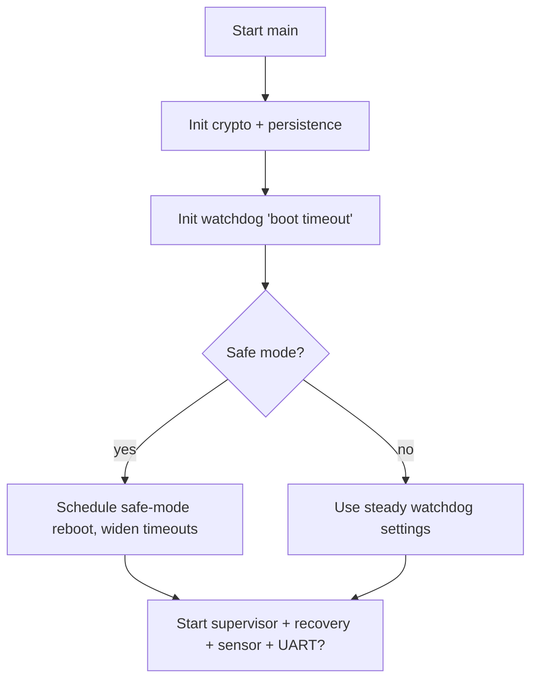
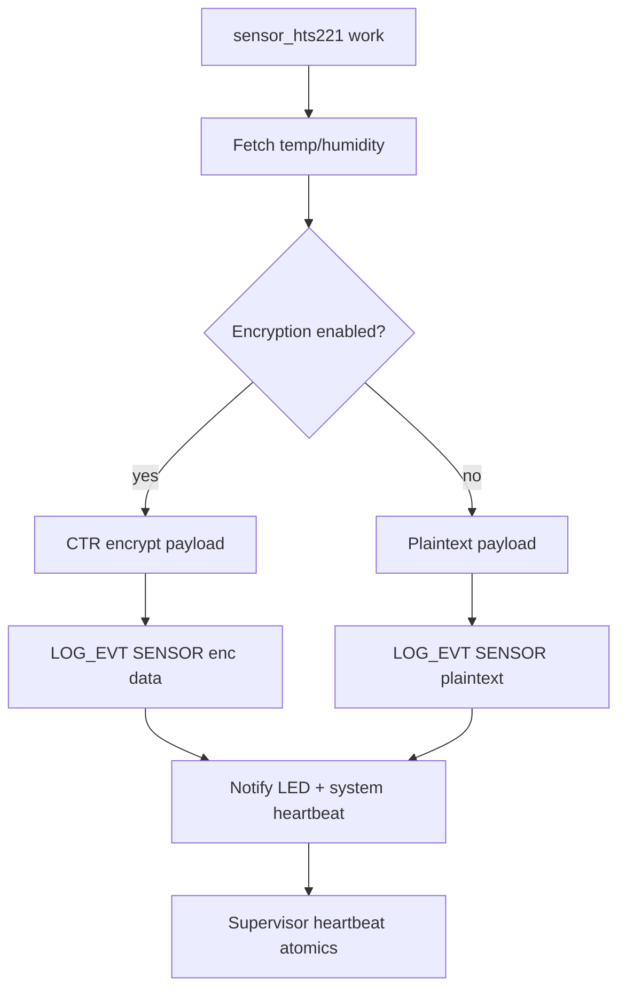
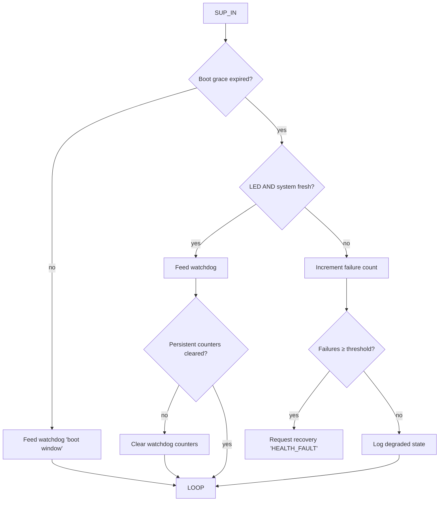
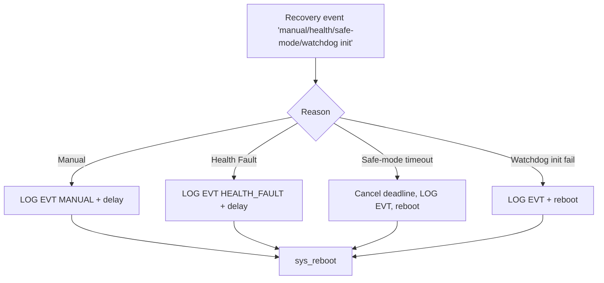
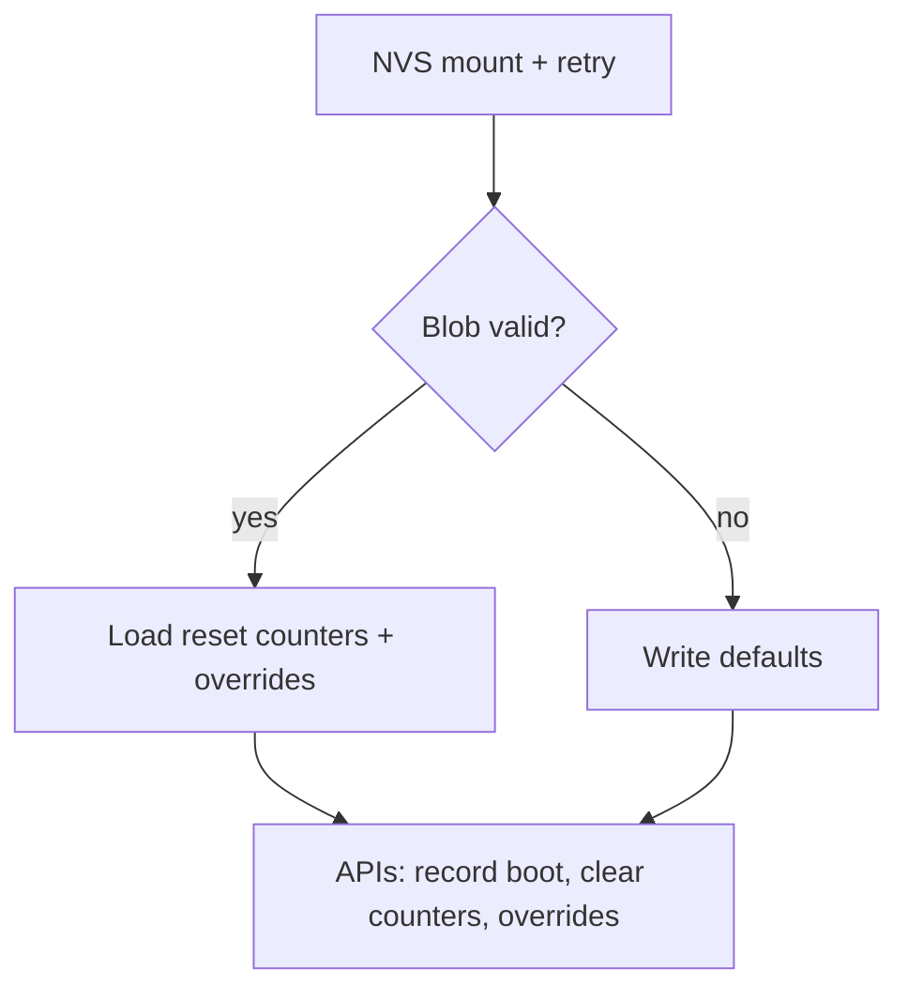
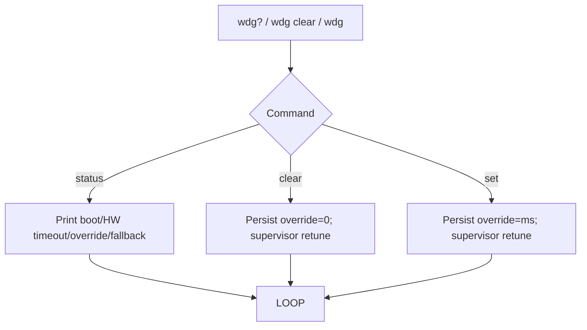

# zephyr-secure-supervisor – Sensor + Watchdog Supervisor Stack
[](https://github.com/ramirezramiro/zephyr-secure-supervisor/actions/workflows/native-sim.yml)

**Board:** STM32 NUCLEO‑L053R8 | **RTOS:** Zephyr 4.2 | **Focus:** Watchdog health, encrypted telemetry, MISRA-inspired hygiene

Designed for the NUCLEO-L053R8’s 8 KB SRAM envelope, zephyr-secure-supervisor keeps watchdog, crypto, and telemetry services lean so low-power boards can adopt it without extra tuning.

## Docs at a Glance

- `docs/architecture.md` – Boot flow, watchdog ownership, and thread/work mapping.
- `docs/components.md` – Module index with links to per-file docs (`sensor_hts221`, `uart_commands`, `simple_aes`, `app_crypto`, etc.).
- `docs/testing.md` + `tests/README.md` – Native + hardware test recipes.
- `docs/supervisor.md` / `docs/recovery.md` / `docs/watchdog_ctrl.md` – State machines and watchdog plumbing.
- `docs/persist_state.md` / `docs/app_crypto.md` / `docs/log_utils.md` – Persistence schema, CTR helper, logging macros.
- `docs/release.md` – Pre-release checklist (tests, artifacts, cleanup).

## Quick Start

See the cheatsheet below for the exact build/flash/test commands; the default workflow is:

1. `west build -b nucleo_l053r8 -p auto .`
2. `west flash -r openocd`
3. `sudo screen /dev/ttyACM0 115200`

Need MISRA hardware tests? Run the MISRA commands in the Testing Strategy section.

### Build & Flash Cheatsheet

| Task | Command(s) | Result |
|------|------------|--------|
| Build + flash application | `west build -b nucleo_l053r8 -p auto . && west flash -r openocd` | Deploys the watchdog/sensor firmware to the board. |
| Monitor UART logs | `sudo screen /dev/ttyACM0 115200` | Shows EVT telemetry + AES transition. |
| Run MISRA hardware ztests | `cd <workspace>; west build -p always <repo>/tests/unit/misra_stage1 -b nucleo_l053r8 --build-dir build/tests/unit/misra_stage1; west flash -r openocd --build-dir build/tests/unit/misra_stage1; sudo screen /dev/ttyACM0 115200` | Executes `tests/unit/misra_stage1` on hardware. |
| Run native persistence test | `west build -b native_sim tests/persist_state -p auto --build-dir build/tests/persist_state && west build -t run --build-dir build/tests/persist_state` | Validates NVS + safe-memory helpers on host. |
| Run native supervisor test | `west build -b native_sim tests/supervisor -p auto --build-dir build/tests/supervisor && west build -t run --build-dir build/tests/supervisor` | Exercises heartbeat/recovery escalation logic. |

## Testing Strategy

| Suite | Target | Command | Coverage |
|-------|--------|---------|----------|
| `tests/persist_state` | `native_sim` | `west build -b native_sim tests/persist_state -p auto --build-dir build/tests/persist_state && west build -t run --build-dir build/tests/persist_state` | NVS state machine, reset counter math, and watchdog override setters without hardware. |
| `tests/supervisor` | `native_sim` | Similar pattern under `tests/supervisor` | Grace windows, heartbeat staleness, failure escalation logic. |
| `tests/unit/misra_stage1` | `nucleo_l053r8` | `west build -p always tests/unit/misra_stage1 -b nucleo_l053r8 && west flash -r openocd` | Hardware validation for safe memory wrappers, AES persistence round-trips, supervisor snapshot helpers, and recovery event plumbing. |

The MISRA suite reuses production sources, so every edit to `safe_memory`, persistence, supervisor, or recovery logic can be proven on the real MCU in under a minute. Use the commands below to build/flash and monitor logs:

```
cd <your-zephyr-workspace>
west build -p always <path-to-repo>/tests/unit/misra_stage1 -b nucleo_l053r8 --build-dir build/tests/unit/misra_stage1
west flash -r openocd --build-dir build/tests/unit/misra_stage1
sudo screen /dev/ttyACM0 115200
```

## Architecture Highlights

zephyr-secure-supervisor combines three always-on services:

| Subsystem | Files | Purpose |
|-----------|-------|---------|
| **Supervisor & Recovery** | `src/supervisor.c`, `src/recovery.c`, `src/watchdog_ctrl.c` | Own the STM32 IWDG, gate feeds on LED/system heartbeats, and schedule safe-mode or manual warm reboots. |
| **Persistence & Crypto** | `src/persist_state.c`, `src/app_crypto.c`, `src/simple_aes.c`, `src/safe_memory.h` | Maintain reset counters + watchdog overrides in NVS, seal blobs with CTR AES, and wrap libc calls with boundary-checked helpers. |
| **Telemetry & Commands** | `src/sensor_hts221.c`, `src/uart_commands.c`, `src/log_utils.h` | Poll the HTS221 sensor via delayed work, log compact `EVT,<tag>,<status>` lines, and expose an optional UART CLI for watchdog tuning. |

The sensor worker emits ten plaintext samples on boot before enabling AES-CTR (`sample_counter >= 10U` in `src/sensor_hts221.c`), and `LOG_EVT_*` macros (`log_utils.h`) keep telemetry in the `EVT,<tag>,<status>` format covered in `docs/log_utils.md`.

## Key Configuration Options

| Option | Default | Description |
|--------|---------|-------------|
| `CONFIG_APP_SENSOR_SAMPLE_INTERVAL_MS` | 2000 | Steady-state HTS221 polling interval; affects heartbeat cadence and UART volume. |
| `CONFIG_APP_SENSOR_SAFE_MODE_INTERVAL_MS` | 4000 | Slower poll rate while in safe mode to preserve power and leave headroom for recovery work. |
| `CONFIG_APP_USE_AES_ENCRYPTION` | `y` | Enables AES-CTR telemetry + persistence wrapping after the first ten plaintext samples. |
| `CONFIG_APP_RESET_WATCHDOG_THRESHOLD` | 3 | Number of consecutive watchdog resets before safe mode engages. |
| `CONFIG_APP_UART_COMMANDS_ENABLE` | `n` | Optional UART CLI; keep disabled unless you have SRAM headroom. |
| `CONFIG_APP_SENSOR_THREAD_STACK_SIZE` | 768 | Sensor work stack size tuned for 8 KB SRAM; increase only if you add heavier telemetry code. |

All options live in `prj.conf` (or overlay configs) and can be overridden at build time via `west build -D` or `menuconfig`.

## Real-World Applications

| Domain / product slice | Representative deployment | Relevant features & quick start |
|------------------------|---------------------------|--------------------------------|
| **Industrial telemetry node** | Remote environmental monitor logging temperature/humidity and reporting health over UART/Lora. | Start from `sensor_hts221.c` and adjust `CONFIG_APP_SENSOR_SAMPLE_INTERVAL_MS`; keep AES enabled via `CONFIG_APP_USE_AES_ENCRYPTION` for encrypted logs. |
| **Gateway / edge supervisor** | Edge box watching downstream PLCs or radios, rebooting on stalled heartbeats. | Supervisor/recovery threads gate feeds using `supervisor_notify_*`; field-tune watchdog windows with persistent overrides or enable the UART CLI (`CONFIG_APP_UART_COMMANDS_ENABLE=y`). |
| **Safety/compliance prototype** | MISRA-driven demo where auditors expect guarded memory ops and hardware regression tests. | Combine `safe_memory.h`, `docs/MISRA_DEVIATIONS.md`, and `tests/unit/misra_stage1`; run the documented MISRA commands to capture certification evidence. |
| **Field-serviceable watchdog controller** | Utility meter or base station where technicians need to adjust watchdog windows without new firmware. | Expose `wdg?`, `wdg <ms>`, `wdg clear` from `uart_commands.c`; persistence APIs (`persist_state_read/write_watchdog_override`) keep settings across boots. |
| **PQC sandbox** | Lab setup experimenting with post-quantum ciphers on constrained boards. | Swap `simple_aes.c` for a PQC candidate, extend `app_crypto.c`, and reuse supervisor/persistence without edits. |

Adapting to other sensors or transports is as simple as swapping `sensor_hts221.c` while keeping the watchdog/persistence/recovery infrastructure intact.

### UAV / Aerospace / Defense Notes

Small UAV avionics, high-altitude balloon payloads, and defense telemetry pods often mandate deterministic watchdog behavior and audit-ready logs. zephyr-secure-supervisor provides:

- **Dual-heartbeat gating** – call `supervisor_notify_system/led` from each critical task so the IWDG only feeds when both mission loop and LED GPIO are alive, preventing “stuck but fed” failures.
- **Safe-mode escalation** – `persist_state_record_boot` tracks consecutive watchdog resets; when `CONFIG_APP_RESET_WATCHDOG_THRESHOLD` is hit, the system widens watchdog windows and schedules autonomous reboots.
- **AES-sealed telemetry + structured logs** – `app_crypto.c` flips to AES-CTR after ten plaintext samples; `LOG_EVT` lines stream over telemetry radios for post-mission audits.
- **MISRA-inspired guards** – `safe_memory.h`, `docs/MISRA_DEVIATIONS.md`, and `tests/unit/misra_stage1` provide the guardrails auditors expect before approving flight software.
- **Tunable watchdog windows** – `watchdog_ctrl.c` + persistent overrides let you match certification timing (e.g., 8 s boot, 2 s steady) without recompiling firmware.

Swap the HTS221 readings for IMU or mission data, map the supervisor heartbeat hooks to your flight-control tasks, and the rest of the watchdog/persistence/recovery plumbing carries over unchanged.

## System Architecture

#### Boot & Configuration *(src/main.c, src/app_crypto.c, src/persist_state.c, src/watchdog_ctrl.c)*



#### Sensor & Telemetry Loop *(src/sensor_hts221.c, src/app_crypto.c, src/log_utils.h)*



#### Supervisor Decision Tree *(src/supervisor.c, src/watchdog_ctrl.c, src/persist_state.c)*



#### Recovery Logic *(src/recovery.c)*



#### Persistence + UART Overrides *(src/persist_state.c, src/uart_commands.c)*





Key paths:

1. `main()` initializes crypto, persistence, recovery, and watchdog control, then spawns the supervisor thread and schedules HTS221 work (or your sensor of choice).
2. The sensor worker logs telemetry, toggles the LED, and pings the supervisor heartbeat hooks so the watchdog doesn’t feed blindly.
3. Supervisor samples both heartbeat atomics: if fresh, it feeds; if stale, it requests recovery and leaves the watchdog brown-out to force a reboot.
4. Recovery listens for requests (manual, health fault, safe-mode timeout, watchdog init failure) via `k_event` and triggers warm reboots when needed.
5. Persistence keeps reset history and watchdog overrides in NVS. The UART command helper (optional) updates overrides at runtime and asks the supervisor to retune immediately.

## Debug Notes & Lessons

- **Watchdog ownership:** Leave `&iwdg` enabled in the overlay but keep `CONFIG_WDT_DISABLE_AT_BOOT=y`. `watchdog_ctrl_init()` installs the lone STM32 channel, applies the boot timeout, and primes the first feed so later retunes only need the supervisor.
- **Heartbeat gating:** Supervisor keeps two atomics—LED blink and general system heartbeat. Both must be “fresh” (ages less than `CONFIG_APP_HEALTH_*_STALE_MS`) for a feed to occur. If either stalls, the IWDG is deliberately starved and recovery is signaled.
- **Persistence robustness:** Flash/NVS operations are wrapped with retry + event logs. Safe mode clears the watchdog counter immediately, and the first healthy retune also wipes the persistent watchdog history.
- **Structured telemetry:** Because all key events follow `EVT,<tag>,<status>` lines, parsing logs or correlating watchdog escalations with sensor data is trivial.
- **RAM discipline:** Default stacks (`CONFIG_APP_SENSOR_THREAD_STACK_SIZE`, supervisor/recovery sizes) assume 8 KB SRAM. The UART command thread is optional and should remain disabled unless you have spare memory.
- **Visual heartbeat:** After each sensor read, the LED blinks twice (40 ms on/off) as a quick way to confirm telemetry is flowing even before you open the UART console.

```
Memory region         Used Size  Region Size  %age Used
           FLASH:       43492 B        64 KB     66.36%
             RAM:        7600 B         8 KB     92.77%
           SRAM0:          0 GB         8 KB      0.00%
        IDT_LIST:          0 GB        32 KB      0.00%
```

Captured via `west build -b nucleo_l053r8 -p always .` from the Zephyr workspace.

## Sample UART Output

```
*** Booting Zephyr OS build v4.2.0-6484-g196a1da504bd ***
[00:00:00.010,000] <inf> app: EVT,APP,START
[00:00:00.015,000] <inf> app_crypto: AES helper initialized (key_len=32)
[00:00:00.024,000] <inf> fs_nvs: 32 Sectors of 128 bytes
[00:00:00.030,000] <inf> fs_nvs: alloc wra: 18, 58
[00:00:00.035,000] <inf> fs_nvs: data wra: 18, 38
[00:00:00.041,000] <inf> persist_state: Persistent state loaded: consecutive=0 total=323 override=0
[00:00:00.069,000] <inf> app: EVT,WATCHDOG,CONFIGURED,boot_ms=8000,steady_ms=2000,retune_delay_ms=500
[00:00:00.079,000] <inf> sensor_hts221: EVT,SENSOR,HTS221_READY,interval_ms=2000,fallback=no,led=on
[00:00:00.208,000] <inf> app: EVT,APP,READY
[00:00:01.088,000] <wrn> supervisor: EVT,WATCHDOG,RETUNE_NOT_SUPPORTED,rc=-134
[00:00:02.089,000] <inf> sensor_hts221: EVT,SENSOR,HTS221_SAMPLE,temp_mc=21750,humidity_mpc=70500
[00:00:04.259,000] <inf> sensor_hts221: EVT,SENSOR,HTS221_SAMPLE,temp_mc=21750,humidity_mpc=70500
[00:00:06.429,000] <inf> sensor_hts221: EVT,SENSOR,HTS221_SAMPLE,temp_mc=21750,humidity_mpc=70500
[00:00:08.600,000] <inf> sensor_hts221: EVT,SENSOR,HTS221_SAMPLE,temp_mc=21750,humidity_mpc=71000
[00:00:10.770,000] <inf> sensor_hts221: EVT,SENSOR,HTS221_SAMPLE,temp_mc=21750,humidity_mpc=71000
[00:00:12.940,000] <inf> sensor_hts221: EVT,SENSOR,HTS221_SAMPLE,temp_mc=21750,humidity_mpc=71000
[00:00:15.110,000] <inf> sensor_hts221: EVT,SENSOR,HTS221_SAMPLE,temp_mc=21875,humidity_mpc=70500
[00:00:17.281,000] <inf> sensor_hts221: EVT,SENSOR,HTS221_SAMPLE,temp_mc=21750,humidity_mpc=70500
[00:00:19.451,000] <inf> sensor_hts221: EVT,SENSOR,HTS221_SAMPLE,temp_mc=21875,humidity_mpc=70500
[00:00:21.621,000] <inf> sensor_hts221: EVT,SENSOR,HTS221_SAMPLE,temp_mc=21750,humidity_mpc=70500
[00:00:23.791,000] <inf> sensor_hts221: Enabling AES telemetry after initial plaintext samples
[00:00:23.801,000] <inf> sensor_hts221: EVT,SENSOR,HTS221_SAMPLE,enc=1,iv=07C18D4CCFA983F536170C74,data=08B660794A1CB00B642C06D82FAF8A1D
[00:00:25.976,000] <inf> sensor_hts221: EVT,SENSOR,HTS221_SAMPLE,enc=1,iv=429854481885B2C91CA460DF,data=6F5471438FA60DD0A6D042E461B26232
```

Captured on NUCLEO-L053R8 at 115200 bps after flashing with `west flash -r openocd`.

## Consulting & Attribution

“zephyr-secure-supervisor ramirezramiro — STM32L0 Zephyr Watchdog + Telemetry + Recovery Stack” ships a production-ready watchdog, persistence, and recovery pipeline that cuts Zephyr bring-up time from weeks to days on STM32L0 hardware. If you reuse it, keep the included NOTICE file, cite the project name, and consider linking back here. **Need integration help or custom features?** Open a GitHub issue or connect via [LinkedIn](https://www.linkedin.com/in/ramiro-ramirez-tw/).

## Troubleshooting & FAQ

- **Build fails with “No HTS221 instance found”** – Ensure the X-NUCLEO-IKS01A2 shield is enabled and the board overlay (`boards/nucleo_l053r8_secure_supervisor*.overlay`) is applied so the `st_hts221` node exists.
- **`EVT,WATCHDOG,RETUNE_NOT_SUPPORTED` warning** – Harmless on STM32L0: the hardware driver can’t change window mode after init, so the supervisor logs the warning and continues with the last valid timeout.
- **UART CLI missing** – `CONFIG_APP_UART_COMMANDS_ENABLE` defaults to `n` to save RAM. Flip it to `y` only if you have headroom; otherwise, expect no CLI prompt.
- **Flash succeeds but no LED blink/logs** – Verify `CONFIG_APP_SENSOR_SAMPLE_INTERVAL_MS` isn’t zero, and confirm `/dev/ttyACM0` is the correct serial device or that the LED alias exists in the overlay.

Need deeper dives? See `docs/architecture.md` for block diagrams, `docs/testing.md` for detailed test recipes, `docs/recovery.md` / `docs/supervisor.md` for state machines, and `docs/components.md` for module-by-module notes. The MISRA deviation log (`docs/MISRA_DEVIATIONS.md`) documents the endemic Zephyr macros (logging) and permanent supervisor loops we intentionally keep.***

## Post-Quantum Migration Template (PQC)

The cryptographic core (`src/app_crypto.c`, `src/simple_aes.c`) is already isolated from the watchdog, persistence, and telemetry stacks, so it doubles as a drop-in PQC playground. Swapping AES-CTR for a NIST-standard primitive (Kyber, Dilithium, etc.) only touches that cipher module; the persistence APIs and log formatting stay intact, and all existing supervisor/watchdog behaviors continue to run unmodified.
