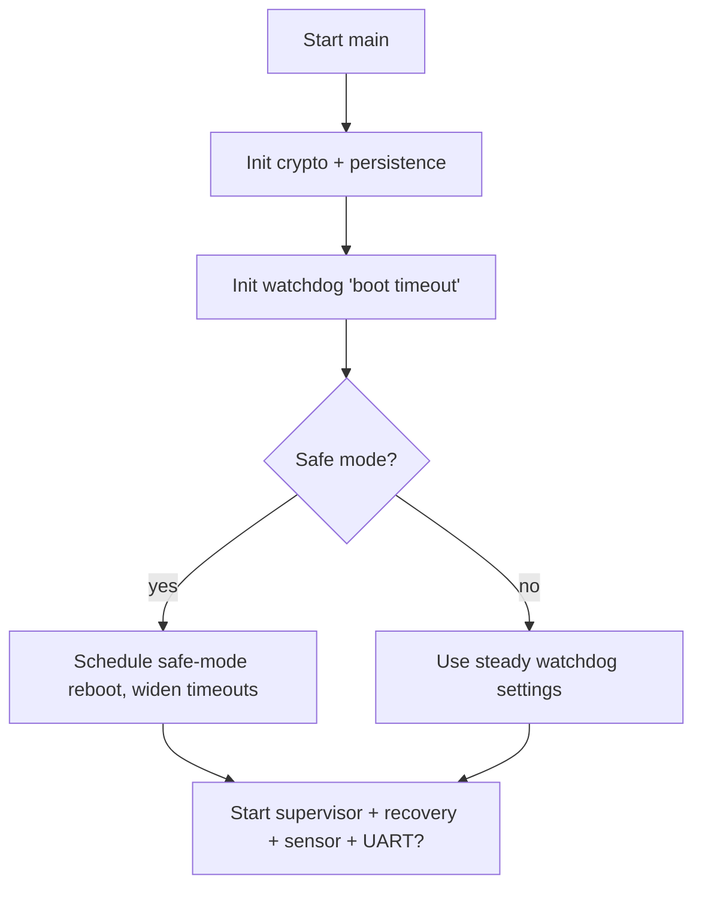

# zephyr-secure-supervisor Architecture

zephyr-secure-supervisor is a Zephyr 4.2 application targeting the STM32 NUCLEO-L053R8. The design keeps the always-on services (watchdog, persistence, telemetry, recovery) loosely coupled so the watchdog policy can evolve without rewriting sensor or crypto plumbing.

## Boot Sequence (src/main.c)
1. Initialize the crypto helpers (`app_crypto_init`) and mount persistence (`persist_state_mount`).
2. Decide if safe mode is active based on the persisted consecutive watchdog resets and config thresholds.
3. Configure the hardware watchdog via `watchdog_ctrl_init`, priming an initial boot timeout.
4. Start the supervisor thread, recovery thread, sensor work queue item, and (optionally) the UART CLI.

Safe mode widens timeouts and schedules an autonomous reboot while still letting the rest of the system start in a degraded configuration.

### Boot Flow Diagram

## Watchdog Control Stack
- `src/watchdog_ctrl.c` owns the STM32 IWDG channel and exposes helpers to retune the timeout (boot vs steady windows) and to feed the dog.
- `src/supervisor.c` is the only component that calls `watchdog_feed_when_healthy`. It samples LED and system heartbeat atomics and only feeds when both are fresh.
- `src/recovery.c` subscribes to `k_event` reasons (manual, health fault, safe-mode timeout, watchdog init failure) and reboots the MCU on demand.

This separation keeps hardware ownership in one place while supervisor/recovery focus on policy.

## Persistence + Crypto
- `src/persist_state.c` lazily mounts the NVS partition (defined in `boards/nucleo_l053r8_secure_supervisor*.overlay`), stores reset counters, watchdog overrides, and (when Curve25519 is enabled) the device scalar + session counter so every boot can derive a fresh AES/MAC key. Flash operations include retry/backoff and all failures produce `EVT,PERSIST,...` logs.
- `src/app_crypto.c` implements CTR encryption on top of `src/simple_aes.c`. In Curve25519 mode the shared secret mixes with the persisted session counter + a salt to derive both the AES key and a MAC key per boot; AES-only builds keep using the static key from Kconfig.
- `include/safe_memory.h` wraps mem* calls with bounds-aware helpers so MISRA-inspired rules are enforced in both production code and tests.

Because the cryptographic helpers are isolated, they act as the template for PQC experiments without touching supervisor/recovery/persistence code.

## Sensor + Telemetry Loop (`src/sensor_hts221.c`)
- Runs as delayed work on Zephyr's system queue.
- Samples the HTS221, keeps 10 plaintext readings before enabling AES output, and logs `EVT,SENSOR,...` lines. When the Curve backend is active it also appends `mac=<crc>` so receivers can authenticate each frame.
- Calls `supervisor_notify_led` and `supervisor_notify_system` whenever telemetry is produced so the watchdog has proof of liveness tied to real sensor activity.

`src/log_utils.h` defines `LOG_EVT_SIMPLE` / `LOG_EVT` macros that map to Zephyr logging while preserving compact `EVT,<tag>,<status>` formatting.

## Thread and Work Mapping
| Component | Primitive | File(s) | Notes |
|-----------|-----------|---------|-------|
| Supervisor | `k_thread` | `src/supervisor.c` | Enforces grace windows, staleness thresholds, and recovery escalation | 
| Recovery | `k_thread` + `k_event` | `src/recovery.c` | Handles manual/safe-mode/watchdog-init faults and reboots |
| Sensor | `k_work_delayable` | `src/sensor_hts221.c` | Fetches HTS221, encrypts payloads, emits heartbeats |
| UART CLI (optional) | `k_thread` | `src/uart_commands.c` | `wdg?`, `wdg <ms>`, `wdg clear` commands for field overrides |

## Data Paths
1. Sensor work logs telemetry and updates heartbeat atomics.
2. Supervisor samples heartbeats and either feeds the watchdog or signals recovery.
3. Recovery clears safe-mode timers or reboots via `sys_reboot`.
4. Persistence records every boot and clears counters once healthy, exposing overrides to both supervisor and UART CLI.

These paths are intentionally narrow so MISRA ztests (`tests/unit/misra_stage1`) can pull in the same sources and validate the production behavior on hardware.
