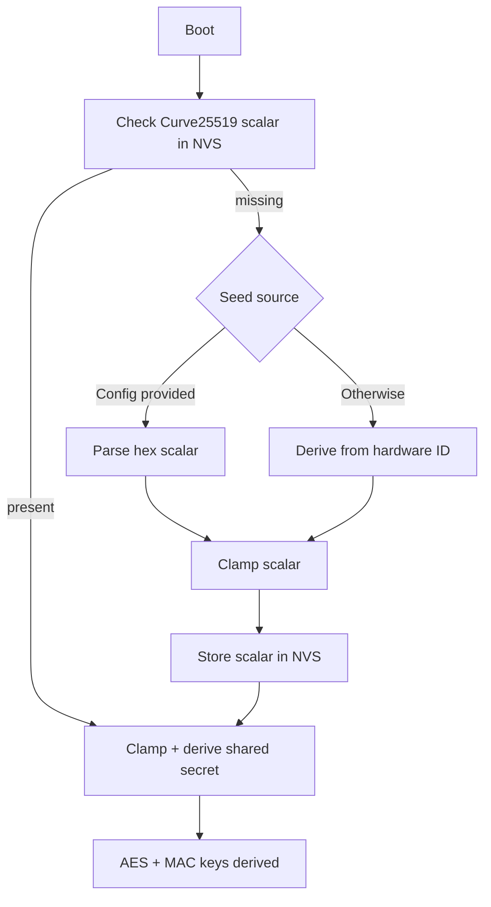

# Crypto Backends & Migration Hooks

zephyr-secure-supervisor isolates its crypto so the rest of the watchdog/sensor stack stays untouched regardless of the algorithm you plug in. Use this file alongside `docs/app_crypto.md` whenever you need to flip between AES-only mode and the Curve25519-backed prototype.

## Backend Matrix

| Backend option | Kconfig toggle | UART/behavior | Notes |
|----------------|----------------|---------------|-------|
| AES-CTR (default) | `CONFIG_APP_CRYPTO_BACKEND_AES=y` + `CONFIG_APP_USE_AES_ENCRYPTION=y` | Standard “`app_crypto: AES helper initialized (key_len=32)`” on boot, telemetry flips to encrypted after ten plaintext samples | Production path. `CONFIG_APP_AES_STATIC_KEY_HEX` / `CONFIG_APP_AES_STATIC_IV_HEX` hold the static material. |
| Curve25519 (TweetNaCl ref10) | `CONFIG_APP_CRYPTO_BACKEND_CURVE25519=y` + `CONFIG_APP_USE_CURVE25519=y` + curve key configs | `app_crypto: Curve25519 key ready (local_pub=....)` then `AES helper initialized (key_len=32, backend=curve25519)`; telemetry encrypts with the derived shared secret | Device private scalar + peer public key come from `CONFIG_APP_CURVE25519_STATIC_*`. The shared secret seeds the AES helper so the rest of the stack stays untouched. |

### How to Flip

| Scenario | File to edit | UART cue | Build impact |
|----------|--------------|----------|--------------|
| Force AES-only mode | `zephyr-apps/helium_tx/prj.conf` (or `menuconfig`) – set `CONFIG_APP_CRYPTO_BACKEND_AES=y` and ensure Curve is unset | `app_crypto: AES-only backend active (static key from config)` followed by `Enabling AES telemetry…` | Rebuild + flash |
| Enable Curve backend | Same file – enable `CONFIG_APP_CRYPTO_BACKEND_CURVE25519=y`, `CONFIG_APP_USE_CURVE25519=y`, and populate `CONFIG_APP_CURVE25519_STATIC_*` | `app_crypto: Curve25519 backend active…` plus `Enabling Curve25519-backed AES telemetry…` | Rebuild + flash |

Both backends are mutually exclusive to keep the 8 KB SRAM footprint in check.

## Curve25519 Details

### Implementation

- `src/curve25519_ref10.c/.h` bundle the TweetNaCl ref10 Montgomery ladder trimmed for Cortex-M0+, so no external library is needed.
- The code only builds when `CONFIG_APP_CRYPTO_BACKEND_CURVE25519=y`, letting AES-only drops strip it out entirely.

### Per-Device Scalar Storage

- Each device keeps its Curve25519 scalar in NVS (`storage_partition`). First boot seeds it from `CONFIG_APP_CURVE25519_STATIC_SECRET_HEX`; if unset, the firmware derives one from the hardware ID.
- Scalars are clamped before storage and whenever they are read back, guarding against corrupted NVS entries.
- Replace the default RFC 7748 test vector before shipping hardware.

### Session Lifecycle

- `app_crypto.c` clamps the scalar, mixes it with the peer public key (`CONFIG_APP_CURVE25519_STATIC_PEER_PUB_HEX`), and derives both the AES key and a 16-byte MAC key.
- Every boot logs `EVT,PQC,SESSION,counter=?,salt=?` so receivers can recompute keys deterministically.
- `sensor_hts221.c` appends `mac=%08X` to encrypted samples. The MAC = `crc32(derived_mac_key || iv || ciphertext || counter) ^ salt`.

### UART Cues

- **AES-only boot:**
  ```
  *** Booting Zephyr OS build … ***
  [00:00:00.015,000] <inf> app_crypto: AES helper initialized (key_len=32)
  [00:00:23.803,000] <inf> sensor_hts221: Enabling AES telemetry after initial plaintext samples
  ```
- **Curve25519 boot:**
  ```
  *** Booting Zephyr OS build … ***
  [00:00:00.776,000] <inf> app_crypto: EVT,PQC,SESSION,counter=1,salt=0x47CB2DF5
  [00:00:01.449,000] <inf> app_crypto: Curve25519 key ready (local_pub=808A7FFF..., peer fixed)
  [00:00:01.457,000] <inf> app_crypto: Curve25519 backend active (shared secret drives AES keys)
  [00:00:01.467,000] <inf> app_crypto: AES helper initialized (key_len=32, backend=curve25519)
  [00:00:25.251,000] <inf> sensor_hts221: Enabling Curve25519-backed AES telemetry after initial plaintext samples
  [00:00:25.263,000] <inf> sensor_hts221: EVT,SENSOR,HTS221_SAMPLE,enc=1,…,mac=XXXXXXX
  ```



### Why Not Hardware Hardening?

STM32L053R8 lacks secure elements, TrustZone, and OTP storage, and we already consume ~90 % of SRAM. Encrypting the scalar at rest or adding tamper checks would cost more flash/RAM without real protection. For this board we stop at:

- Per-device scalars recorded in NVS.
- Session counters and salts logged to UART.
- MAC tags on telemetry for authenticity.

For true hardware-backed roots of trust, see `docs/deployment.md` for MCU recommendations.
