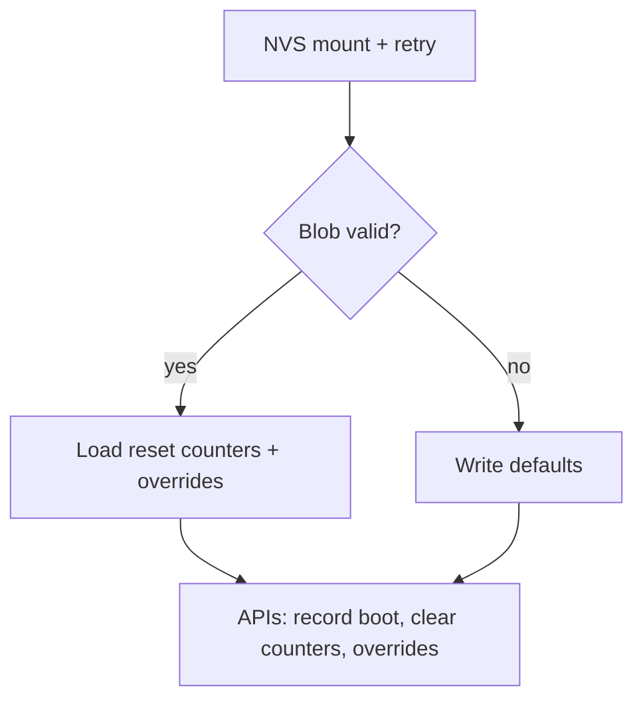

# persist_state.c

`src/persist_state.c` keeps zephyr-secure-supervisor’s reset history and watchdog overrides in Zephyr’s NVS partition so reboots do not erase key telemetry.

## Data Stored
- `consecutive_watchdog` / `total_watchdog` reset counters.
- Watchdog override window (milliseconds) set via UART or safe-mode logic.
- `session_counter` – monotonic counter the Curve25519 backend uses when deriving per-boot AES/MAC keys.
- Curve25519 device scalar record (`CURV` slot) so every board keeps a unique keypair across reboots.
- Validation blob so the code knows when flash contains a fully written state block.
- (Provisioning builds only) Curve25519 peer public key update when the provisioning overlay auto-persists `CONFIG_APP_CURVE25519_STATIC_PEER_PUB_HEX`.

## Behaviors
1. Lazily mounts the `storage_partition` defined in the NUCLEO overlay (`boards/nucleo_l053r8_secure_supervisor*.overlay`).
2. Retries flash operations with backoff; any failure emits `EVT,PERSIST,...` log lines.
3. Provides APIs for the rest of the system:
   - `persist_state_record_boot()` – increment boot counters and decide if safe mode should engage.
   - `persist_state_clear_watchdog_history()` – called by supervisor once the system is healthy so future boots start fresh.
   - `persist_state_read/write_watchdog_override()` – used by UART CLI and supervisor to adjust watchdog windows.
   - `persist_state_curve25519_get_secret()` – hands out the Curve25519 scalar, seeding it from config or hardware ID the first time and persisting it for later.
   - `persist_state_next_session_counter()` – atomically increments the session counter used by `app_crypto` when deriving per-session keys.

### NVS Flow Diagram

## Testing
See `tests/persist_state` (native_sim) and `tests/unit/misra_stage1` (hardware) for coverage of every code path.

## Provisioning auto-persist

When `CONFIG_APP_PROVISION_BUILD=y` and `CONFIG_APP_PROVISION_AUTO_PERSIST=y`, `main.c` decodes the build-time `CONFIG_APP_CURVE25519_STATIC_*` strings immediately after `persist_state_init()` and calls `persist_state_curve25519_set_secret/peer()` to write them into NVS. This provides a UART-free provisioning path during factory builds. Production firmware should disable `CONFIG_APP_PROVISION_AUTO_PERSIST` so it never overwrites existing keys; it will continue to call `persist_state_curve25519_get_*()` and use whatever the provisioning image stored.
