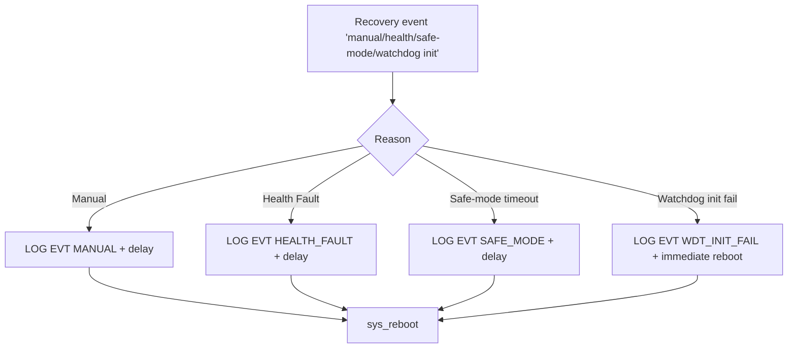

# Recovery Thread

`src/recovery.c` owns the reboot policy for zephyr-secure-supervisor. It runs as a Zephyr thread that blocks on a `k_event` bitmask so multiple subsystems can request a warm reboot without directly resetting the MCU.

## Event Sources
| Event | Origin | Description |
|-------|--------|-------------|
| `RECOVERY_EVT_MANUAL` | UART `wdg clear` / command handler | Field operator requests a manual reboot after adjusting overrides |
| `RECOVERY_EVT_HEALTH_FAULT` | Supervisor thread | Supervisor detected stale heartbeats beyond the configured failures threshold |
| `RECOVERY_EVT_SAFE_MODE_TIMEOUT` | `main()` safe-mode timer | Consecutive watchdog resets forced safe mode and a delayed reboot |
| `RECOVERY_EVT_WDT_INIT_FAIL` | `watchdog_ctrl_init` | The hardware watchdog channel could not be configured at boot |

## State Machine
1. Wait on `k_event_wait` for any of the bits above.
2. Classify the reason and log a structured line via `LOG_EVT_SIMPLE("RECOVERY", ...)` so UART logs indicate the trigger.
3. Apply optional dead time (e.g., manual and health faults delay briefly to flush logs).
4. Call `sys_reboot(SYS_REBOOT_COLD)` to restart the STM32.

Safe-mode deadlines are tracked under a mutex to avoid multiple reboots being queued simultaneously. Cancelling or rescheduling the delayed work updates this deadline so the MCU cannot thrash.

### Recovery Flow Diagram

## Interaction With Persistence
- Recovery clears safe-mode timers once a healthy supervisor reset occurs.
- When safe mode triggers, the first healthy supervisor cycle clears the persistent watchdog counters so the system can exit degraded mode on the next boot.

## Logging Contract
Every recovery path emits `EVT,RECOVERY,<reason>` lines, ensuring flight logs or industrial telemetry archives record why a reboot happened (manual command vs health fault vs watchdog init failure). This data is critical for downstream MISRA audits and field debugging.
