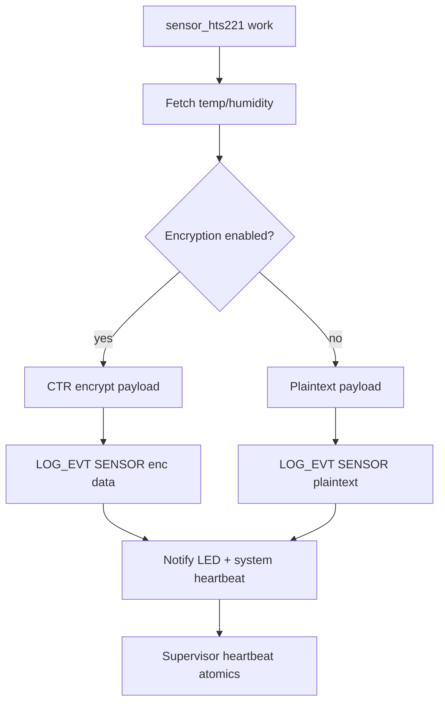

# sensor_hts221.c

`src/sensor_hts221.c` implements the default telemetry source for zephyr-secure-supervisor. It uses Zephyr’s HTS221 driver and delayed work to produce heartbeats tied to real sensor reads.

## Workflow
1. Schedule a `k_work_delayable` item on the system work queue during `main()`.
2. Each run reads temperature and humidity, logs plaintext samples for the first ten cycles, then switches to AES-encrypted payloads (with Curve25519-backed keys when enabled).
3. After producing telemetry, it toggles the LED heartbeat and calls `supervisor_notify_led` / `supervisor_notify_system` so the watchdog only feeds when actual data flows.

### Telemetry Flowchart

## Logging Format
- Plaintext: `EVT,SENSOR,PLAIN,temp_mC=...,hum_mpermil=...`
- Encrypted (AES-only): `EVT,SENSOR,ENC,iv=...,cipher=...`
- Encrypted (Curve25519 session): `EVT,SENSOR,ENC,iv=...,cipher=...,mac=XXXXXXXX` where `mac` is derived from the per-session MAC key so receivers can authenticate each frame.

## Extensibility
Swapping sensors simply means replacing this file (or adding another worker) while keeping the heartbeat notifications identical. That makes it trivial to support IMUs, pressure sensors, or mission payloads without touching persistence or recovery code.
