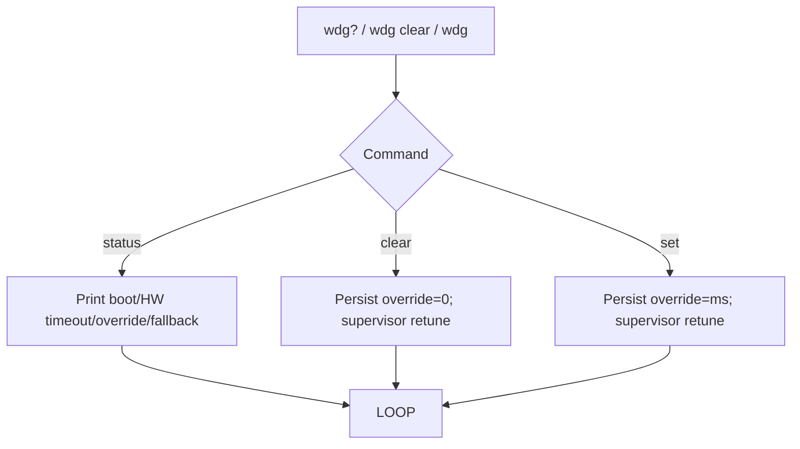

# uart_commands.c

`src/uart_commands.c` hosts the optional UART CLI that field technicians can enable when they have spare SRAM. It translates simple text commands into watchdog override actions without rebooting or reflashing.

## Commands
- `wdg?` – prints the current boot timeout, steady timeout, persistent override (if present), fallback ms, and recent reset counters.
- `wdg <ms>` – stores a persistent override via `persist_state_write_watchdog_override` and notifies the supervisor to retune immediately.
- `wdg clear` – clears any override and returns to the compiled watchdog windows.

## Implementation Notes
- Runs as a Zephyr thread with a modest stack (disabled by default to keep RAM free).
- Consumes `uart_rx_enable` from Zephyr’s UART driver and parses ASCII tokens.
- Uses the `LOG_EVT` macros to produce `EVT,UART,...` lines for audit trails.
- Calls `supervisor_request_manual_recovery` when a command requires an immediate reboot.

### Command Flow Diagram

Enable the CLI by setting the project-specific Kconfig option (see `prj.conf`) once you know the target board has room for the extra stack and UART buffers.
